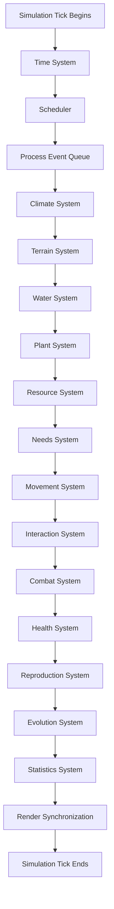

# SIM-002 — Simulation Loop

**Version:** 1.0.0

**Status:** Approved

**Owner:** Gaia Engine Team

**Last Updated:** 2026-06-27

---

# Purpose

Defines the execution order of the simulation.

Every simulation update performed by Gaia Engine follows this document.

No system may change this execution order without an approved Architecture Decision Record (ADR).

---

# Scope

This specification defines:

- Simulation Tick
- Tick execution order
- Scheduling rules
- Update frequencies
- Synchronization
- Determinism requirements

---

# Overview

Gaia Engine does not execute gameplay using frames.

Instead, it executes discrete Simulation Ticks.

Rendering may run at any frame rate.

Simulation always advances using fixed logical ticks.

---

# Simulation Clock

The Simulation Clock represents logical engine time.

Properties:

- Fixed interval
- Independent from rendering
- Deterministic
- Never skips internal state

Example:

Simulation Tick #125480

Simulation Tick #125481

Simulation Tick #125482

---

# World Clock

The World Clock represents in-game time.

Examples:

06:30

09:15

17:42

Winter Day 18

Year 42

The World Clock advances according to Simulation Time.

Gameplay systems interact with the World Clock.

Simulation systems interact with the Simulation Clock.

---

# Simulation Pipeline

---

# Tick Responsibilities

Each system owns exactly one responsibility.

Example:

Climate System

Updates weather conditions.

Never modifies organisms directly.

Movement System

Moves organisms.

Never updates reproduction.

Evolution System

Processes genetic inheritance.

Never renders creatures.

---

# Scheduler

The Scheduler decides:

- when a system executes
- execution frequency
- execution priority

Systems never schedule themselves.

---

# Update Frequencies

Example configuration:

| System     | Frequency        |
| ---------- | ---------------- |
| Time       | Every Tick       |
| Climate    | Every 10 Ticks   |
| Plants     | Every 20 Ticks   |
| Statistics | Every 100 Ticks  |
| Save       | Every 1000 Ticks |

Execution frequency is configurable.

---

# Event Processing

Events generated during a Tick are queued.

They are processed in deterministic order.

Events never execute immediately.

Benefits:

- Predictable execution
- Easier debugging
- Thread-safe scheduling
- Deterministic replay

---

# Tick Atomicity

A Simulation Tick is atomic.

Either:

- completes successfully

or

- is rolled back

Partial simulation updates are forbidden.

---

# Simulation Speed

Supported multipliers:

- Pause
- x1
- x2
- x4
- x8
- x16

Simulation correctness must never depend on speed.

---

# Rendering Synchronization

Rendering is not part of the simulation.

At the end of each Tick:

Simulation State

↓

Presentation Snapshot

↓

Renderer

The renderer never modifies simulation data.

---

# Background Simulation

Gaia Engine supports headless execution.

Headless mode disables:

- rendering
- UI
- audio

Simulation continues normally.

Use cases:

- automated testing
- balancing
- benchmarking
- dedicated servers (future)

---

# Performance Budget

Target Tick duration:

≤ 5 ms

Profiler must record:

- execution time
- event count
- active organisms
- active plants
- active chunks
- memory allocation

---

# Design Constraints

The Simulation Loop must remain:

- deterministic
- platform independent
- renderer independent
- thread-safe
- testable

---

# Related Documents

SIM-001 — Simulation Philosophy

CORE-001 — Core Architecture

SIM-003 — Event Bus

ARCH-001 — Architecture Overview

---

# Acceptance Criteria

- [ ] Simulation uses logical ticks.
- [ ] Rendering is fully decoupled.
- [ ] Scheduler owns execution order.
- [ ] Events execute deterministically.
- [ ] Tick execution is atomic.
- [ ] Background simulation is supported.

---

# Revision History

## 1.0.0

Initial version.
