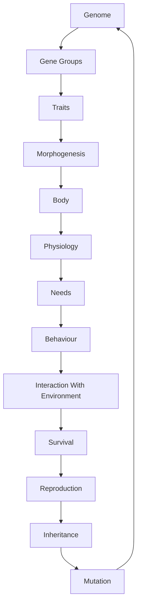

# GEN-001 — Evolution Pipeline

**Version:** 1.0.0

**Status:** Approved

**Owner:** Gaia Engine Team

---

# Purpose

Defines how inherited information becomes a living organism.

This document describes the complete biological transformation pipeline used by Gaia Engine.

---

# Philosophy

Evolution does not build organisms directly.

Evolution modifies genomes.

Genomes influence development.

Development creates bodies.

Bodies define capabilities.

Capabilities influence survival.

Survival influences reproduction.

Reproduction drives evolution.

---

# Complete Pipeline

---

# Stage 1 — Genome

Stores inherited biological instructions.

Genome never changes during an organism lifetime.

---

# Stage 2 — Gene Groups

Genes are evaluated in functional groups.

Examples:

- Body Shape
- Metabolism
- Reproduction
- Sensory System
- Pigmentation
- Growth

---

# Stage 3 — Traits

Traits are expressed characteristics.

Examples:

- Large body
- Fast metabolism
- Night vision
- Thick fur
- Long neck

Traits are not physical structures.

Traits are biological properties.

---

# Stage 4 — Morphogenesis

Builds the organism using the generated traits.

Examples:

- body proportions
- limb count
- head shape
- tail length
- skin covering

---

# Stage 5 — Body

The completed anatomical structure.

The Body becomes the input for physiology.

---

# Stage 6 — Physiology

The body begins functioning.

Examples:

- energy consumption
- oxygen usage
- digestion
- temperature regulation

---

# Stage 7 — Needs

Physiology continuously generates needs.

Examples:

- hunger
- thirst
- rest
- reproduction

---

# Stage 8 — Behaviour

Behaviour Systems react to current needs and environmental stimuli.

Behaviour is never encoded in the genome.

---

# Stage 9 — Environment

The organism interacts with:

- climate
- terrain
- resources
- predators
- prey
- competitors

---

# Stage 10 — Survival

Successful organisms reproduce more frequently.

Failed organisms disappear naturally.

---

# Stage 11 — Inheritance

Parents generate a new Genome.

The offspring never receives a direct copy.

Inheritance combines genetic information.

---

# Stage 12 — Mutation

Random variation modifies the new Genome.

Mutations introduce long-term diversity.

---

# Design Constraints

Every stage has one responsibility.

Every stage produces deterministic output.

No stage may skip another.

---

# Related Documents

GEN-002 — Genome

GEN-003 — Morphogenesis

GEN-004 — Mutation

ORG-001 — Organism

SIM-001 — Simulation Philosophy

---

# Acceptance Criteria

- [ ] Genome remains immutable.
- [ ] Body is generated through Morphogenesis.
- [ ] Behaviour is independent from genetics.
- [ ] Evolution operates through inheritance.
- [ ] Every stage has one responsibility.

---

# Revision History

## 1.0.0

Initial version.
